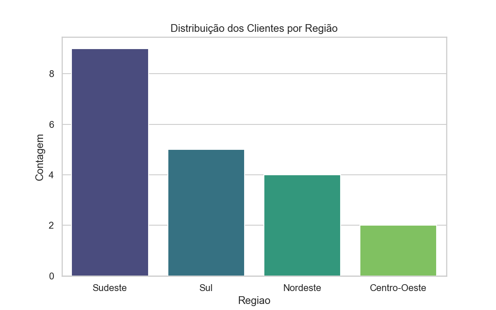
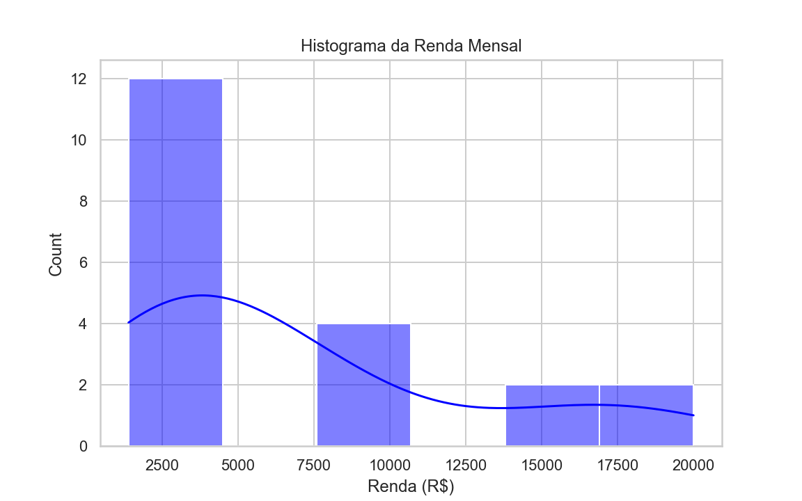
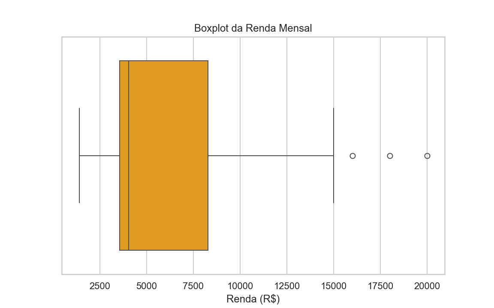
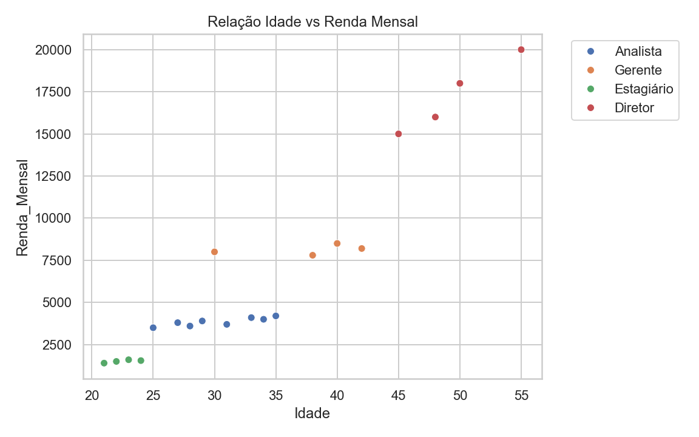

# 👥 People Analytics: Análise de Salários e Carreira


## 📝 Sobre o Projeto
Este projeto apresenta um pipeline de **Análise Exploratória de Dados (EDA)** focado em Recursos Humanos (*People Analytics*).

O objetivo foi aplicar técnicas de Estatística Descritiva utilizando Python para analisar padrões salariais, distribuição demográfica e correlações entre variáveis de carreira (como Idade e Renda) em um dataset simulado.

## 🧠 Análises Realizadas
O script gera visualizações para responder a perguntas de negócio como:
* Qual a distribuição de colaboradores por região?
* Como os salários estão distribuídos? (Detecção de assimetrias)
* Existem *outliers* (valores discrepantes) nos salários?
* Existe correlação linear entre a idade do colaborador e sua renda?

## 🛠️ Tecnologias Utilizadas
* **Python:** Linguagem base.
* **Pandas:** Manipulação e estruturação dos dados tabulares.
* **Seaborn & Matplotlib:** Visualização de dados estatísticos.
* **OS:** Gerenciamento de diretórios para exportação automática dos relatórios visuais.

## 📈 Visualizações Geradas

### 1. Distribuição Geográfica
Análise de frequência absoluta dos colaboradores por região.


### 2. Análise de Renda (Histograma)
Visualização da distribuição de frequência dos salários.


### 3. Detecção de Outliers (Boxplot)
Uso de medidas de posição (quartis) para identificar dispersão salarial.


### 4. Correlação: Idade x Renda
Gráfico de dispersão para investigar a relação entre maturidade profissional e remuneração.


## 🚀 Como Executar
1. Clone este repositório.
2. Instale as dependências:
   ```bash
   pip install pandas seaborn matplotlib